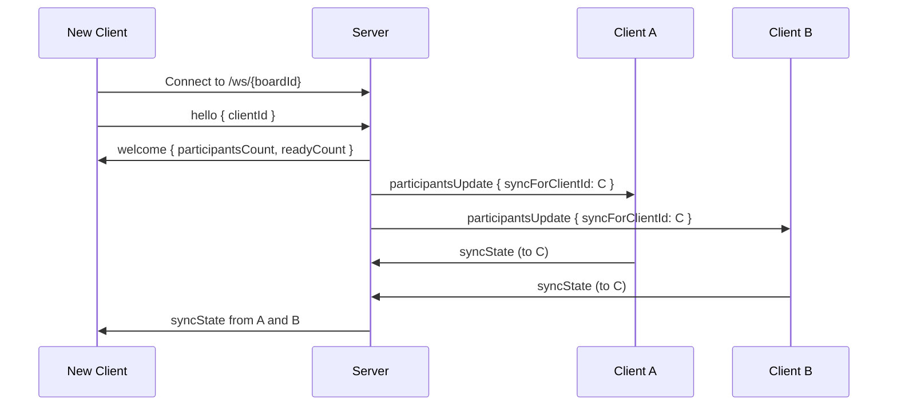
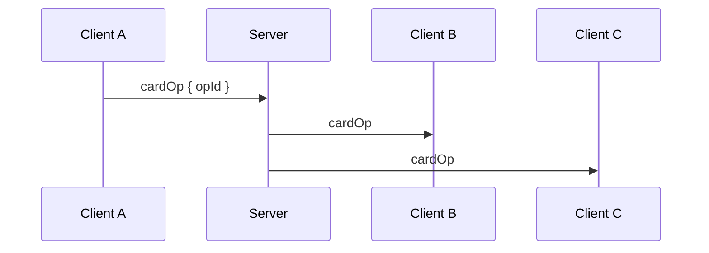

# Communication Protocol

Delta Board uses WebSockets for real-time collaboration between clients. The server acts primarily as a message broker and keeps only minimal in-memory session state required for presence. No board data is persisted on the server.

## Message Types

| Type                                             | Direction                     | Description                                     |
| ------------------------------------------------ | ----------------------------- | ----------------------------------------------- |
| [hello](#schema-hello)                           | Client → Server               | Initial handshake, includes clientId            |
| [welcome](#schema-welcome)                       | Server → Client               | Returns participant counts, then initiates sync |
| [participantsUpdate](#schema-participantsupdate) | Server → Clients              | Broadcast when presence or readiness changes    |
| [setReady](#schema-setready)                     | Client → Server               | Participant updates readiness state             |
| [phaseChanged](#schema-phasechanged)             | Client → Clients (via Server) | Broadcast phase transition to reviewing         |
| [syncState](#schema-syncstate)                   | Client → Client (via Server)  | Send full board state to a new client           |
| [cardOp](#schema-cardop)                         | Client → Clients (via Server) | Card operation (create, edit, or delete)        |
| [vote](#schema-vote)                             | Client → Clients (via Server) | Vote operation (add or remove)                  |
| [error](#schema-error)                           | Server → Client               | Indicates an operation was rejected             |
| [ping](#schema-ping)                             | Client → Server               | Heartbeat to indicate client is alive           |
| [pong](#schema-pong)                             | Server → Client               | Acknowledges heartbeat                          |

## Schema Version

This document defines protocol schema **v1**.

## Message Schemas

All messages are JSON objects sent over the WebSocket connection.

<a id="schema-common-types"></a>

### Common Types

- `opId`: string (UUID or collision-resistant unique id)
- `clientId`: string (stable per browser profile)
- `phase`: `"forming" | "reviewing"`
- `column`: `"well" | "delta"`
- `rev`: number (monotonic per entity, including votes)

<a id="schema-id-generation"></a>

### Id Generation

- `clientId`: generated once and persisted per browser profile (UUID v4 recommended)
- `opId`: generated per operation (UUID v4 recommended)
- `cardId`: generated when a card is created (UUID v4 recommended)

<a id="schema-hello"></a>

### `hello` (Client → Server)

```json
{ "type": "hello", "clientId": "..." }
```

- `type` (string, required)
- `clientId` (string, required)

<a id="schema-welcome"></a>

### `welcome` (Server → Client)

```json
{ "type": "welcome", "participantsCount": 4, "readyCount": 2 }
```

- `type` (string, required)
- `participantsCount` (number, required)
- `readyCount` (number, required)
- `welcome` provides the new client with the current counts; the server does **not** send a `participantsUpdate` back to the joining client.

<a id="schema-participantsupdate"></a>

### `participantsUpdate` (Server → Clients)

```json
{ "type": "participantsUpdate", "participantsCount": 5, "readyCount": 3 }
```

```json
{
  "type": "participantsUpdate",
  "participantsCount": 5,
  "readyCount": 3,
  "syncForClientId": "..."
}
```

- `type` (string, required)
- `participantsCount` (number, required)
- `readyCount` (number, required)
- `syncForClientId` (string, optional; when present, indicates who needs a [syncState](#schema-syncstate))
- On join/leave, the server broadcasts `participantsUpdate` to **all other** connected clients (not the initiator).

<a id="schema-setready"></a>

### `setReady` (Client → Server)

```json
{ "type": "setReady", "opId": "uuid", "isReady": true }
```

- `type` (string, required)
- `opId` (string, required)
- `isReady` (boolean, required)

<a id="schema-phasechanged"></a>

### `phaseChanged` (Client → Clients via Server)

```json
{ "type": "phaseChanged", "opId": "uuid", "phase": "reviewing" }
```

- `type` (string, required)
- `opId` (string, required)
- `phase` (string, required; target phase)

<a id="schema-syncstate"></a>

### `syncState` (Client → Client via Server)

```json
{
  "type": "syncState",
  "targetClientId": "...",
  "phase": "forming",
  "cards": [
    {
      "id": "...",
      "rev": 2,
      "column": "well",
      "text": "...",
      "authorId": "...",
      "isDeleted": false
    }
  ],
  "votes": [{ "cardId": "...", "voterId": "...", "rev": 3, "isDeleted": false }]
}
```

- `type` (string, required)
- `targetClientId` (string, optional; when omitted, server broadcasts to all clients except the sender)
- `phase` (string, required)
- `cards` (array, required)
  - `id` (string, required)
  - `rev` (number, required)
  - `column` (string, required)
  - `text` (string, required)
  - `authorId` (string, required)
  - `isDeleted` (boolean, required)
- `votes` (array, required)
  - `cardId` (string, required)
  - `voterId` (string, required)
  - `rev` (number, required)
  - `isDeleted` (boolean, required)

<a id="schema-cardop"></a>

### `cardOp` (Client → Clients via Server)

Create:

```json
{
  "type": "cardOp",
  "opId": "uuid",
  "phase": "forming",
  "action": "create",
  "cardId": "...",
  "rev": 1,
  "column": "well",
  "text": "...",
  "authorId": "..."
}
```

Edit:

```json
{
  "type": "cardOp",
  "opId": "uuid",
  "phase": "forming",
  "action": "edit",
  "cardId": "...",
  "rev": 2,
  "column": "well",
  "text": "Updated text",
  "authorId": "..."
}
```

Delete:

```json
{
  "type": "cardOp",
  "opId": "uuid",
  "phase": "forming",
  "action": "delete",
  "cardId": "...",
  "rev": 3,
  "authorId": "..."
}
```

- `type` (string, required)
- `opId` (string, required)
- `phase` (string, required)
- `action` (string, required: `create | edit | delete`)
- `cardId` (string, required)
- `rev` (number, required)
- `column` (string, required for `create` and optional for `edit`)
- `text` (string, required for `create` and optional for `edit`)
- `authorId` (string, required for `create`, `edit`, and `delete`)

<a id="schema-vote"></a>

### `vote` (Client → Clients via Server)

```json
{
  "type": "vote",
  "opId": "uuid",
  "phase": "forming",
  "action": "add",
  "cardId": "...",
  "voterId": "...",
  "rev": 2
}
```

```json
{
  "type": "vote",
  "opId": "uuid",
  "phase": "forming",
  "action": "remove",
  "cardId": "...",
  "voterId": "...",
  "rev": 3
}
```

- `type` (string, required)
- `opId` (string, required)
- `phase` (string, required)
- `action` (string, required: `add | remove`)
- `cardId` (string, required)
- `voterId` (string, required)
- `rev` (number, required; monotonic per `voterId` per `cardId`)

<a id="schema-error"></a>

### `error` (Server → Client)

```json
{ "type": "error", "opId": "uuid", "reason": "Invalid message" }
```

- `type` (string, required)
- `opId` (string, required)
- `reason` (string, required)

<a id="schema-ping"></a>
<a id="schema-pong"></a>

### `ping` / `pong`

```json
{ "type": "ping" }
```

```json
{ "type": "pong" }
```

- `type` (string, required)

## Server Authority

The server is authoritative for:

- Connected participant count
- Readiness state per participant

The server does not track:

- Board phase (managed by clients via replicated state)
- Cards or votes (managed by clients)

Clients must treat [participantsUpdate](#schema-participantsupdate) events from the server as the source of truth for presence and readiness.

## Trust Model

Clients are assumed to be controlled by us. The protocol favors simplicity over adversarial security.
Malicious or modified clients can cheat (for example, forging votes or bypassing phase rules), and we accept this limitation.

## Reliable Operation Delivery

All state-changing client operations ([cardOp](#schema-cardop), [vote](#schema-vote), [setReady](#schema-setready), [phaseChanged](#schema-phasechanged)) must include a unique `opId`.

If an operation is invalid, the server responds:
See the `error` schema in the Message Schemas section: [error](#schema-error).

This provides at-least-once delivery with idempotent convergence.

Clients keep all seen `opId` values in memory for the life of the board session.
Boards are short-lived, so unbounded growth is acceptable for this project.

### Reliability & Acknowledgements

The following messages MUST include `opId`:

- [cardOp](#schema-cardop)
- [vote](#schema-vote)
- [setReady](#schema-setready)
- [phaseChanged](#schema-phasechanged)

The following messages do NOT include `opId`:

- [hello](#schema-hello)
- [welcome](#schema-welcome)
- [participantsUpdate](#schema-participantsupdate)
- [syncState](#schema-syncstate)
- [error](#schema-error)
- [ping](#schema-ping) / [pong](#schema-pong)

## Connection Flow

See the [hello](#schema-hello), [welcome](#schema-welcome), [participantsUpdate](#schema-participantsupdate), and [syncState](#schema-syncstate) schemas.



## Operation Broadcast Flow

All operations are idempotent and include an `opId`.



Clients must ignore duplicate operations based on `opId`.

## Card Revision Model

Cards follow a Last-Write-Wins (LWW) model per card.

Each card has a monotonically increasing `rev` managed by the card author.
See the [cardOp](#schema-cardop) schema.

```json
{
  "type": "cardOp",
  "opId": "uuid",
  "phase": "forming",
  "action": "edit",
  "cardId": "...",
  "rev": 3,
  "text": "Updated text"
}
```

Clients apply a card edit only if the incoming `rev` is greater than the stored revision.
This prevents older edits from overwriting newer ones.

Deletes are also versioned operations and must carry a higher `rev`.
Deleted cards must be retained as tombstones (`isDeleted: true`) so they do not resurrect during merges.

### Revision Tie-Break

If two updates arrive with the same `rev`, clients break ties deterministically by comparing the `clientId` of the author.
The update with the lexicographically higher `clientId` wins.

## Vote Model

Each card allows one vote per `voterId`. Votes use LWW per `(cardId, voterId)` with a monotonic `rev`.
Each vote operation contains an `opId` and is idempotent.
See the [vote](#schema-vote) schema.

```json
{
  "type": "vote",
  "opId": "uuid",
  "phase": "forming",
  "action": "add",
  "cardId": "...",
  "voterId": "..."
}
```

Clients apply a vote update only if the incoming `rev` is greater than the stored value for that `(cardId, voterId)`.
If `rev` is equal, `remove` wins to avoid resurrecting a vote.
In `syncState`, `isDeleted: true` represents a removed vote tombstone.

## State Sync

`syncState` provides a snapshot with revisions. See the `syncState` schema in the Message Schemas section: [syncState](#schema-syncstate).

### Merge Rules

Cards and votes share the same LWW merge rule:

- For each entity (card by `id`, vote by `(cardId, voterId)`), keep the highest `rev`
- If `rev` is equal, compare the entity owner id (card: `authorId`, vote: `voterId`) lexicographically; higher wins
- If `rev` and owner id are equal, `isDeleted: true` wins to prevent resurrection

Phase is monotonic: `reviewing` overrides `forming` whenever states are merged.

Clients may receive multiple `syncState` responses when joining.
For a stable initial view, clients should wait a short join window (for example, 1-2 seconds) to collect snapshots before using the board.
If no `syncState` arrives in that window, proceed with local state and continue listening for later snapshots.
After the join-time merge window completes, the client should proactively broadcast its merged `syncState` once, even if the local state did not change.
If no client with intact local state reconnects, the board state cannot be recovered.

## Phase Enforcement

Phase is enforced by clients:

- Clients include their current phase in every operation
- If a client is in reviewing and receives an operation with phase forming, it must reject it

The transition is monotonic and idempotent.

## Client Validation

Clients must validate outgoing and incoming operations:

- Required fields are present and well-typed
- `phase` matches the current local phase
- `rev` is a non-decreasing integer per card
- `rev` is a non-decreasing integer per `(cardId, voterId)`
- `cardId`/`opId`/`clientId` are valid ids

## Implementation Rules

- `authorId` and `voterId` MUST equal the sender's `clientId` (v1 has no separate user identity).
- For cards: clients set `rev = (max rev seen for that card) + 1` when editing or deleting.
- For votes: clients set `rev = (max rev seen for that (cardId, voterId)) + 1` when adding or removing.
- Clients SHOULD persist current card/vote `rev` values as part of local state so reloads do not reset counters.
- On join, clients SHOULD buffer incoming operations while collecting `syncState`, then apply buffered ops after the join-time merge completes.
- `syncState` SHOULD be targeted using `targetClientId`. Broadcasting a `syncState` (omitting `targetClientId`) should only be done once after the join-time merge window completes.

## Client Identity

Each client generates and persists a `clientId`.
Opening the board in a new browser or private window creates a new participant identity.

### Duplicate Connection Prevention

A single `clientId` should have at most one active connection per board. Multiple tabs with the same identity cause revision conflicts and unpredictable state.

Clients SHOULD use the [Web Locks API](https://developer.mozilla.org/en-US/docs/Web/API/Web_Locks_API) to enforce single-tab access:

1. Before connecting, request an exclusive lock scoped to the board (e.g., `delta-board-{boardId}`)
2. If the lock is unavailable, display an error and do not connect
3. Hold the lock for the session lifetime; it auto-releases when the tab closes

The server MAY also reject a `hello` from a `clientId` that is already connected to the same board, responding with an [error](#schema-error) message. This provides a fallback if the client-side check is bypassed or unsupported.

## Connection Health and Heartbeats

Clients send [ping](#schema-ping) every 10 seconds.
Server drops connections after about 30 seconds of inactivity and broadcasts [participantsUpdate](#schema-participantsupdate).

Heartbeats maintain accurate presence. Because quorum depends on presence, they indirectly influence when a phase transition is allowed.
