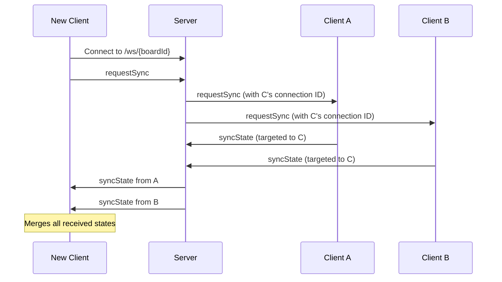
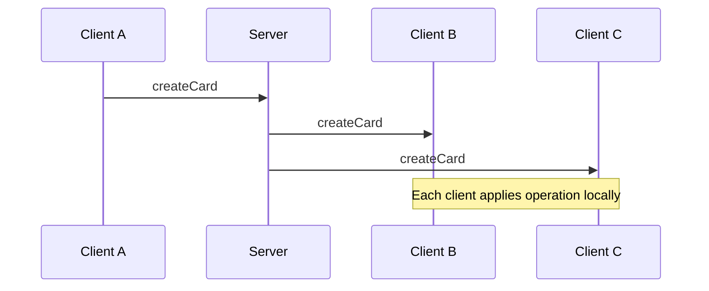

# Communication Protocol

Delta Board uses WebSockets for real-time collaboration between clients. The server acts as a message broker only - it does not store any data.

## Message Types

| Type          | Direction        | Description                          |
| ------------- | ---------------- | ------------------------------------ |
| `requestSync` | Client → Server  | Request state from other clients     |
| `syncState`   | Client → Client  | Send full board state to a requester |
| `createCard`  | Client → Clients | Broadcast new card creation          |
| `editCard`    | Client → Clients | Broadcast card text update           |
| `deleteCard`  | Client → Clients | Broadcast card deletion              |
| `addVote`     | Client → Clients | Broadcast vote added                 |
| `removeVote`  | Client → Clients | Broadcast vote removed               |

## Connection Flow

## Operation Broadcast Flow

## State Sync

When a client connects (or reconnects), it requests state from all other participants. **All connected clients respond with their current state.** The requesting client merges all responses to build the most complete picture of the board.

This approach provides resilience against network partitions - if one client has stale or incomplete data, others may have the missing pieces.

The merge logic is idempotent:

- Cards are added only if they don't already exist (matched by ID)
- Votes are unioned (each voter ID appears at most once per card)
