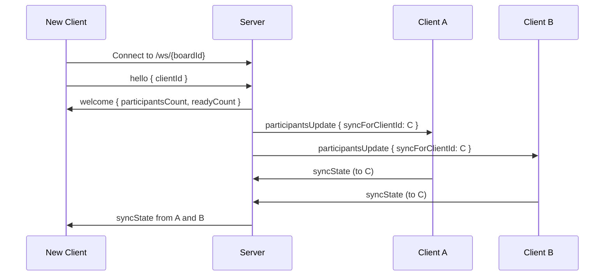
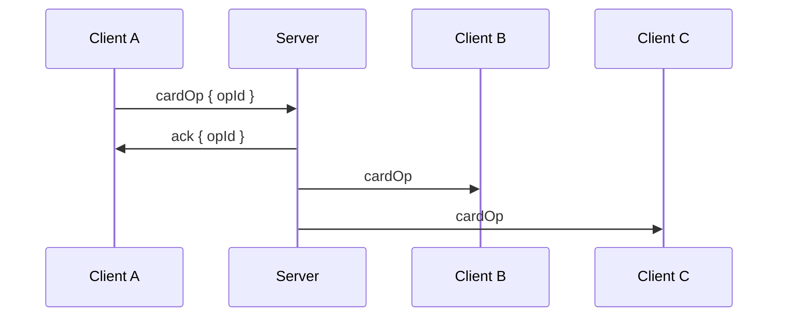

# Communication Protocol

Delta Board uses WebSockets for real-time collaboration between clients. The server acts primarily as a message broker and keeps only minimal in-memory session state required for presence. No board data is persisted on the server.

## Message Types

| Type                 | Direction                     | Description                                              |
| -------------------- | ----------------------------- | -------------------------------------------------------- |
| `hello`              | Client → Server               | Initial handshake, includes clientId                     |
| `welcome`            | Server → Client               | Returns participant counts, then initiates sync          |
| `participantsUpdate` | Server → Clients              | Broadcast when presence or readiness changes             |
| `setReady`           | Client → Server               | Participant updates readiness state                      |
| `phaseChanged`       | Client → Clients (via Server) | Broadcast phase transition to reviewing                  |
| `syncState`          | Client → Client (via Server)  | Send full board state to a new client                    |
| `cardOp`             | Client → Clients (via Server) | Card operation (create, edit, or delete)                 |
| `vote`               | Client → Clients (via Server) | Vote operation (add or remove)                           |
| `ack`                | Server → Client               | Acknowledges receipt of an operation                     |
| `error`              | Server → Client               | Indicates an operation was rejected                      |
| `ping`               | Client → Server               | Heartbeat to indicate client is alive                    |
| `pong`               | Server → Client               | Acknowledges heartbeat                                   |

## Server Authority

The server is authoritative for:

- Connected participant count
- Readiness state per participant

The server does not track:

- Board phase (managed by clients via replicated state)
- Cards or votes (managed by clients)

Clients must treat `participantsUpdate` events from the server as the source of truth for presence and readiness.

## Reliable Operation Delivery

All state-changing client operations (`cardOp`, `vote`, `setReady`, `phaseChanged`) must include a unique `opId`.

The server acknowledges receipt:

```json
{ "type": "ack", "opId": "uuid" }
```

If the client does not receive an `ack` within a short timeout, it must retry sending the same operation with the same `opId`.

If an operation is invalid, the server responds:

```json
{ "type": "error", "opId": "uuid", "reason": "invalidPhase" }
```

This provides at-least-once delivery with idempotent convergence.

## Connection Flow



## Operation Broadcast Flow

All operations are idempotent and include an `opId`.



Clients must ignore duplicate operations based on `opId`.

## Card Revision Model

Each card has a monotonically increasing `rev` managed by the card author.

```json
{
  "type": "cardOp",
  "opId": "uuid",
  "phase": "forming",
  "action": "edit",
  "cardId": "...",
  "rev": 3,
  "text": "Updated text"
}
```

Clients apply a card edit only if the incoming `rev` is greater than the stored revision.
This prevents older edits from overwriting newer ones.

Deletes are also versioned operations and must carry a higher `rev`.

## Vote Model

Votes converge by union. Each vote operation contains an `opId` and is idempotent.

```json
{
  "type": "vote",
  "opId": "uuid",
  "phase": "forming",
  "action": "add",
  "cardId": "...",
  "voterId": "..."
}
```

Duplicate votes are ignored.

## State Sync

`syncState` provides a snapshot with revisions:

```json
{
  "type": "syncState",
  "targetClientId": "...",
  "phase": "forming" | "reviewing",
  "cards": [
    { "id": "...", "rev": 2, "column": "well", "text": "...", "authorId": "..." }
  ],
  "votes": [
    { "cardId": "...", "voterId": "..." }
  ]
}
```

### Merge Rules

- For each card, keep the highest `rev`
- Deletes are treated as higher-rev tombstones
- Votes are unioned
- Phase uses reviewing wins

## Phase Enforcement

Phase is enforced by clients:

- Clients include their current phase in every operation
- If a client is in reviewing and receives an operation with phase forming, it must reject it

The transition is monotonic and idempotent.

## Client Identity

Each client generates and persists a `clientId`.
Opening the board in a new browser or private window creates a new participant identity.

## Connection Health and Heartbeats

Clients send `ping` every 10 seconds.
Server drops connections after about 30 seconds of inactivity and broadcasts `participantsUpdate`.

Heartbeats maintain accurate presence. Because quorum depends on presence, they indirectly influence when a phase transition is allowed.
