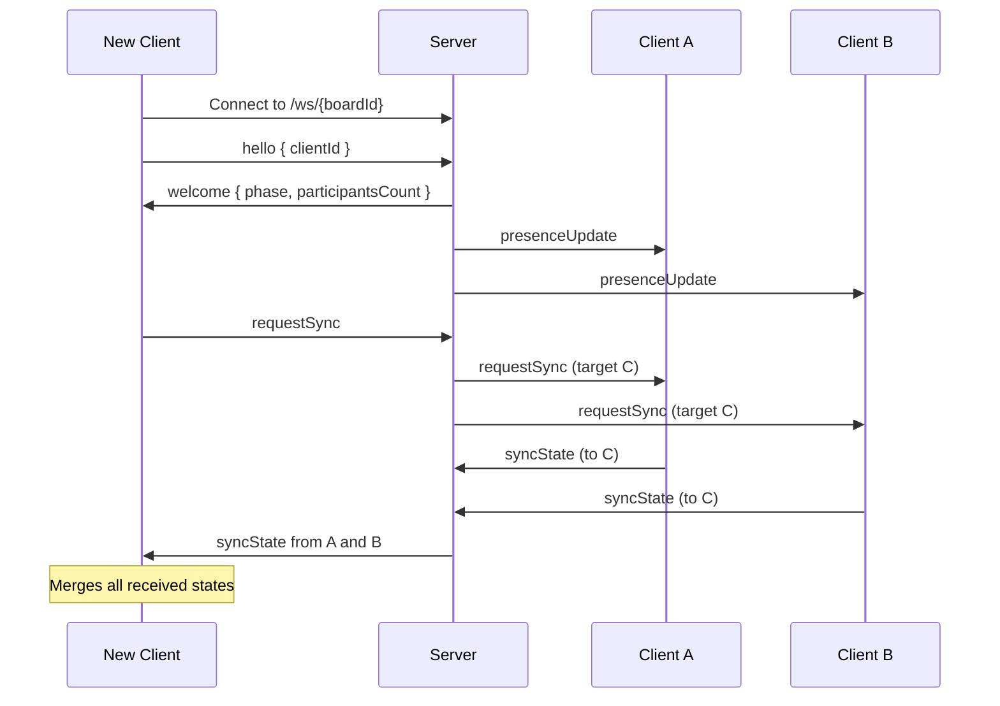
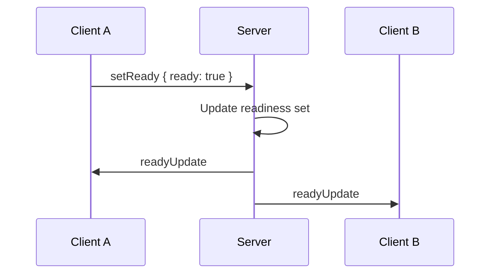
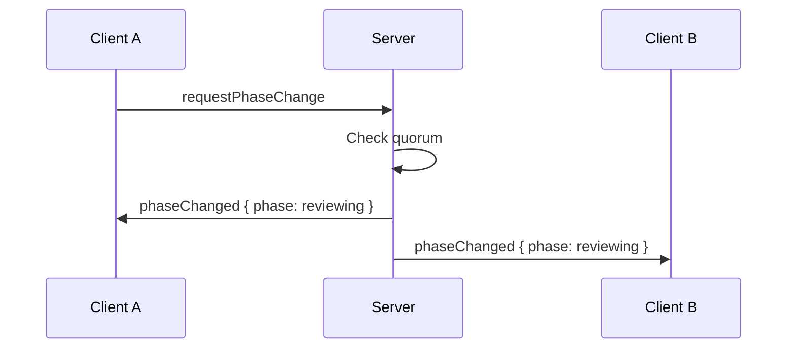
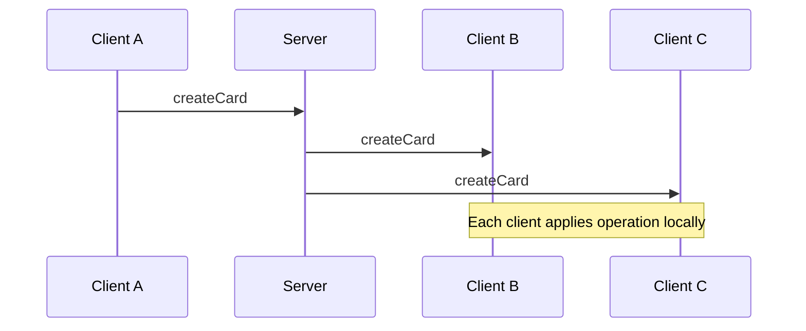

# Communication Protocol

Delta Board uses WebSockets for real time collaboration between clients. The server acts primarily as a message broker and keeps only minimal in memory session state required for presence and phase transitions. No board data is persisted on the server.

## Message Types

| Type                 | Direction                     | Description                               |
| -------------------- | ----------------------------- | ----------------------------------------- |
| `hello`              | Client → Server               | Initial handshake, includes clientId      |
| `welcome`            | Server → Client               | Returns current phase and presence info   |
| `presenceUpdate`     | Server → Clients              | Broadcast when participants join or leave |
| `setReady`           | Client → Server               | Participant updates readiness state       |
| `readyUpdate`        | Server → Clients              | Broadcast updated readiness counts        |
| `requestPhaseChange` | Client → Server               | Request transition to reviewing           |
| `phaseChanged`       | Server → Clients              | Authoritative phase transition event      |
| `requestSync`        | Client → Server               | Request state from other clients          |
| `syncState`          | Client → Client (via Server)  | Send full board state to a requester      |
| `createCard`         | Client → Clients (via Server) | Broadcast new card creation               |
| `editCard`           | Client → Clients (via Server) | Broadcast card text update                |
| `deleteCard`         | Client → Clients (via Server) | Broadcast card deletion                   |
| `addVote`            | Client → Clients (via Server) | Broadcast vote added                      |
| `removeVote`         | Client → Clients (via Server) | Broadcast vote removed                    |
| `ping`               | Client → Server               | Heartbeat to indicate client is alive     |
| `pong`               | Server → Client               | Acknowledges heartbeat                    |

## Server Authority

The server is authoritative for:

- Current board phase
- Connected participant count
- Readiness state per participant

Clients must treat `phaseChanged`, `presenceUpdate`, and `readyUpdate` events from the server as the source of truth, even if their local state differs.

## Connection Flow

## Presence and Readiness

The server maintains an in memory list of connected participants per board based on active WebSocket connections.

### Presence

- When a participant connects or disconnects, the server broadcasts `presenceUpdate`
- Clients use this to display participant counts and compute quorum
- When a participant disconnects, their readiness state is removed along with their presence

### Readiness

The server is authoritative for readiness counts and determines when quorum is reached.

## Phase Transition Flow

Rules:

- The server decides whether quorum is met
- Once `phaseChanged` is broadcast, the board is permanently in reviewing phase
- Clients must lock editing and voting after receiving this event

## Phase Enforcement

All board operations include the sender’s current understanding of the phase.

The server validates operations against the current phase:

- During `forming`, card edits and votes are allowed
- During `reviewing`, card edits and vote changes are rejected

If an operation is invalid for the current phase, the server must ignore it and may optionally send an error response to the sender.

## Operation Broadcast Flow

All operations should be idempotent. Clients must ignore duplicate operations based on operation or entity IDs to ensure consistent convergence across replicas.

## State Sync

When a client connects or reconnects, it requests state from all other participants.

All connected clients respond with their current board state using `syncState`. The requesting client merges all responses to build the most complete picture of the board.

This approach provides resilience against network partitions. If one client has stale or incomplete data, others may have the missing pieces.

The merge logic is idempotent:

- Cards are added only if they do not already exist, matched by ID
- Votes are unioned, each voter ID appears at most once per card

If a client receives board content that conflicts with the server reported phase, the server phase always takes precedence and the client must lock editing.

## Client Identity

Each client generates a random `clientId` and stores it locally, for example in localStorage. This ID is reused across reconnects to preserve vote ownership and readiness state during a session.

If a user opens the board in a new browser or private window, they are treated as a new participant.

## Connection Health and Heartbeats

Because WebSocket connections can appear open even when the network path is broken, Delta Board uses lightweight application level heartbeats to keep presence accurate.

### Client Heartbeat

Each client periodically sends a heartbeat message to the server.

- Clients send `ping` every 10 seconds
- Any normal message such as card edits, votes, or readiness updates also counts as activity and can reset the heartbeat timer

### Server Timeout

The server tracks the last activity time for each connection.

If the server does not receive a `ping` or any other message from a client within a timeout window, for example 30 seconds, it:

1. Closes the WebSocket connection
2. Removes the participant from the presence list
3. Broadcasts a `presenceUpdate` to the remaining clients

Heartbeats are used to maintain accurate connection health and presence information. They do not directly modify board content or participate in state synchronization. However, because presence affects readiness quorum, heartbeats indirectly influence when a phase transition is allowed.
