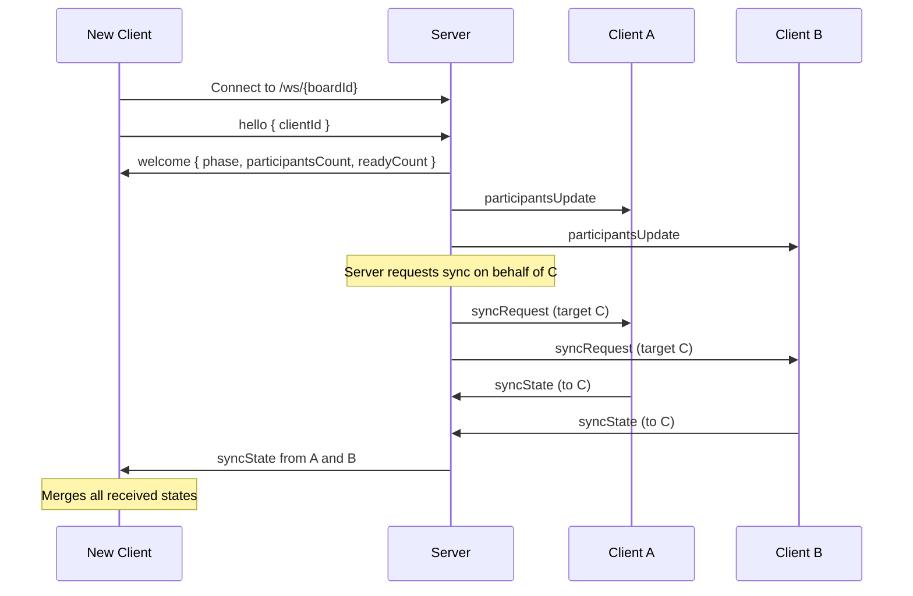
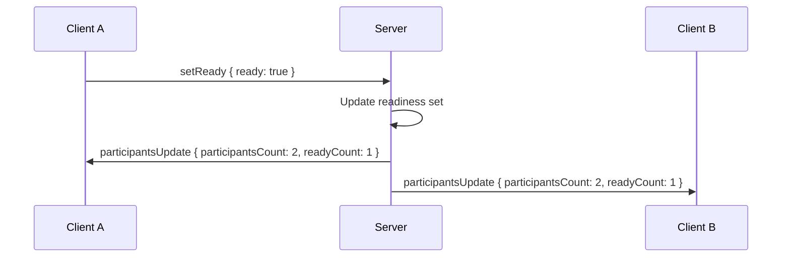
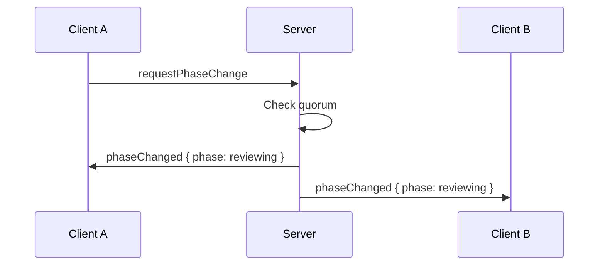
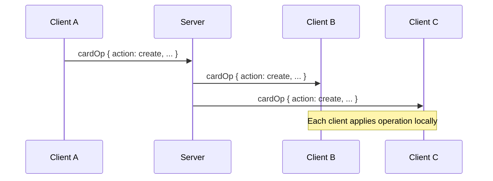

# Communication Protocol

Delta Board uses WebSockets for real time collaboration between clients. The server acts primarily as a message broker and keeps only minimal in memory session state required for presence and phase transitions. No board data is persisted on the server.

## Message Types

| Type                 | Direction                     | Description                                              |
| -------------------- | ----------------------------- | -------------------------------------------------------- |
| `hello`              | Client → Server               | Initial handshake, includes clientId                     |
| `welcome`            | Server → Client               | Returns phase, participant counts, then initiates sync   |
| `participantsUpdate` | Server → Clients              | Broadcast when presence or readiness changes             |
| `setReady`           | Client → Server               | Participant updates readiness state                      |
| `requestPhaseChange` | Client → Server               | Request transition to reviewing                          |
| `phaseChanged`       | Server → Clients              | Authoritative phase transition event                     |
| `syncState`          | Client → Client (via Server)  | Send full board state to a new client                    |
| `cardOp`             | Client → Clients (via Server) | Card operation (create, edit, or delete)                 |
| `vote`               | Client → Clients (via Server) | Vote operation (add or remove)                           |
| `ping`               | Client → Server               | Heartbeat to indicate client is alive                    |
| `pong`               | Server → Client               | Acknowledges heartbeat                                   |
| `error`              | Server → Client               | Indicates an operation was rejected                      |

## Server Authority

The server is authoritative for:

- Current board phase
- Connected participant count
- Readiness state per participant

Clients must treat `phaseChanged` and `participantsUpdate` events from the server as the source of truth, even if their local state differs.

## Connection Flow



## Presence and Readiness

The server maintains an in-memory list of connected participants per board based on active WebSocket connections.

The `participantsUpdate` message combines both presence and readiness information:

```json
{
  "type": "participantsUpdate",
  "participantsCount": 5,
  "readyCount": 3
}
```

This message is broadcast when:
- A participant connects or disconnects
- A participant changes their readiness state

When a participant disconnects, their readiness state is automatically removed.

Quorum is always calculated based on currently connected participants. When participants leave, quorum may be reached automatically and the server may allow or trigger a phase transition.



The server is authoritative for participant and readiness counts, and determines when quorum is reached.

## Phase Transition Flow



Rules:

- The server decides whether quorum is met
- Once `phaseChanged` is broadcast, the board is permanently in reviewing phase
- Clients must lock editing and voting after receiving this event

## Phase Enforcement

All client operations (`cardOp`, `vote`) must include the sender’s current understanding of the board phase.

The server validates operations against its authoritative phase:

- During `forming`, card edits and votes are allowed
- During `reviewing`, card edits and vote changes are rejected

If an operation’s phase does not match the server’s phase, it must be rejected.

If an operation is rejected due to phase mismatch or invalid state, the server should send an `error` message back to the sender describing the reason. The operation must not be broadcast.

## Operation Broadcast Flow

Card and vote operations use a unified format with an `action` field and unique operation ID:

```json
{
  "type": "cardOp",
  "opId": "uuid",
  "phase": "forming",
  "action": "create" | "edit" | "delete",
  "cardId": "...",
  "column": "well" | "delta",
  "text": "...",
  "authorId": "..."
}
```

```json
{
  "type": "vote",
  "opId": "uuid",
  "phase": "forming",
  "action": "add" | "remove",
  "cardId": "...",
  "voterId": "..."
}
```



All operations are idempotent. Clients must ignore duplicates based on `opId` to ensure consistent convergence across replicas.

## State Sync

When a client connects, the server automatically requests state from all other participants on its behalf.

All connected clients respond with their current board state using `syncState`. The new client merges all responses to build the most complete picture of the board.

This approach provides resilience against network partitions. If one client has stale or incomplete data, others may have the missing pieces.

The merge logic is idempotent:

- Cards are added only if they do not already exist, matched by ID
- Votes are unioned, each voter ID appears at most once per card

If a client receives board content that conflicts with the server reported phase, the server phase always takes precedence and the client must lock editing.

## Client Identity

Each client generates a random `clientId` and stores it locally, for example in localStorage. This ID is reused across reconnects to preserve vote ownership and readiness state during a session.

If a user opens the board in a new browser or private window, they are treated as a new participant.

## Connection Health and Heartbeats

Because WebSocket connections can appear open even when the network path is broken, Delta Board uses lightweight application level heartbeats to keep presence accurate.

### Client Heartbeat

Each client periodically sends a heartbeat message to the server.

- Clients send `ping` every 10 seconds
- Any normal message such as card edits, votes, or readiness updates also counts as activity and can reset the heartbeat timer

### Server Timeout

The server tracks the last activity time for each connection.

If the server does not receive a `ping` or any other message from a client within a timeout window, for example 30 seconds, it:

1. Closes the WebSocket connection
2. Removes the participant from the presence list
3. Broadcasts a `participantsUpdate` to the remaining clients

Heartbeats are used to maintain accurate connection health and presence information. They do not directly modify board content or participate in state synchronization. However, because presence affects readiness quorum, heartbeats indirectly influence when a phase transition is allowed.
